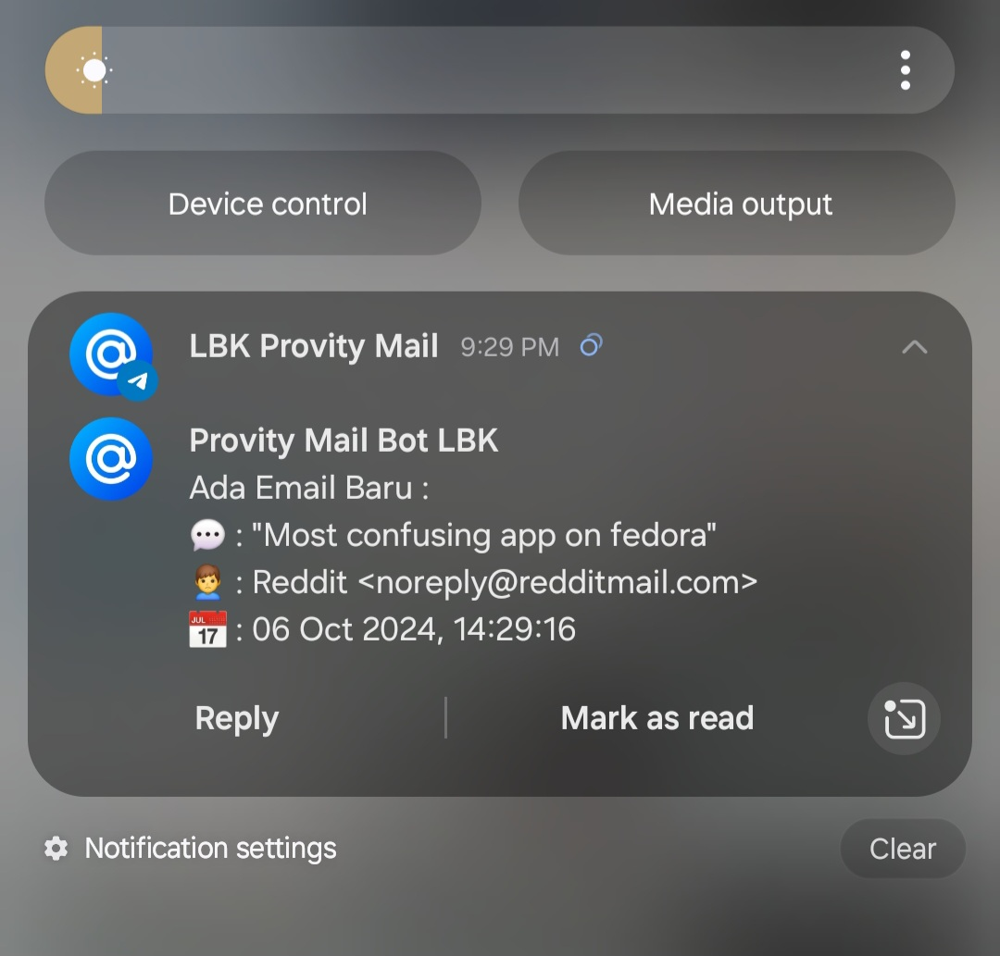

    

# Telegram Bot Email Notification

This is a simple script for sending notification email into a telegram using bot. I create this script using PHP language and IMAP extension.

Flow the program :

1. Program read a list email and loop 10 newset email
2. Program will check are the email has sned to telegram
3. If email not in database (not sned in telegram), then bot will send notification to telegram
3. Program will check / resync email every 60 sec
4. If has a new email, bot will send to telegram and store email history to database

Requirements :

1. PHP
2. IMAP Extension (in XAMPP just open php.ini and find `;extsniosns=imap`, just remove the `;`, if you using ubuntu just type `sudo apt install php-imap`)
3. Path / Environtment variabel PHP in terminal

Running the script :

1. Open script folder `cd tgbot_email`
2. Import the databases
3. run the script `php run.php`

Screenshots :

